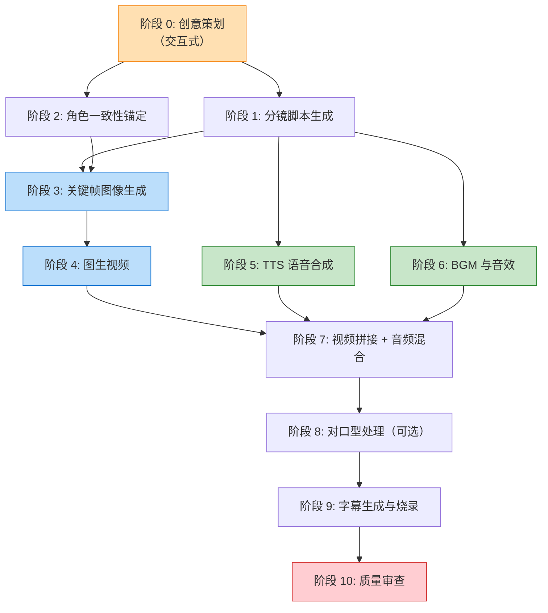
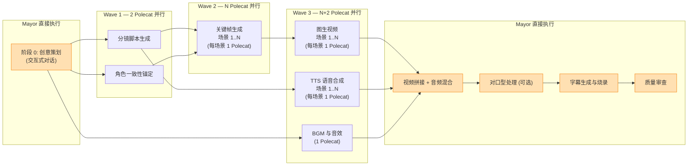

# AI 视频生成工作流定义

> **版本**: v1.1 | **日期**: 2026-03-20 | **状态**: 初稿
>
> 本文档定义 AI 视频制作的完整管线，支持多种视频类型（短剧、宣传片、教程、广告、创意短视频等），作为 GasTown 多智能体并行编排的工作流基础。

---

# 0. 全自动化原则

本工作流设计为 **AI 全自动执行**，所有环节通过 API 或 CLI 调用完成，不依赖任何 App 界面或网页手动操作。

| 原则                     | 说明                                                                                               |
| ------------------------ | -------------------------------------------------------------------------------------------------- |
| **API/CLI Only**   | 每个阶段的模型调用必须有可编程接口（REST API、Python SDK、CLI 命令），能通过代码自动调用           |
| **无人值守**       | 创意策划阶段由 Mayor 与用户对话多轮对话确认后，后续全部阶段自动执行至成片，无需人工干预            |
| **模型选型硬约束** | 仅选用提供 API/SDK/本地推理的模型，纯 App/网页操作的工具（如剪映 App、即梦网页版）不纳入自动化管线 |
| **可验证**         | 每个阶段产出后通过 CLI 工具（ffprobe、identify、wc 等）自动验证，不依赖人工查看                    |
| **幂等可重试**     | 每个 Polecat 任务失败后可安全重试，不影响其他并行任务                                              |

---

## 1. 管线全景

AI 视频制作管线由 **10 个阶段** 组成，从创意策划到最终审片，形成端到端的自动化生产流水线。



### 阶段属性矩阵

| 阶段 | 名称 | 属性 | 适用说明 |
|------|------|------|----------|
| 0 | 创意策划 | **必选** | 所有视频类型 |
| 1 | 分镜脚本生成 | **必选** | 所有视频类型 |
| 2 | 角色一致性锚定 | 可选 | 有固定角色的视频（短剧、系列广告）；无角色的视频（风景宣传片、纯产品广告）可跳过 |
| 3 | 关键帧图像生成 | **必选** | 所有视频类型 |
| 4 | 图生视频 | **必选** | 所有视频类型 |
| 5 | TTS 语音合成 | 可选 | 有台词/旁白的视频需要；纯音乐/纯视觉类可跳过 |
| 6 | BGM 与音效 | 可选（推荐） | 绝大多数视频类型建议启用；纯教程/解说类可简化 |
| 7 | 视频拼接 + 音频混合 | **必选** | 所有多片段视频 |
| 8 | 对口型处理 | 可选 | 仅角色有面部特写且有台词时启用 |
| 9 | 字幕生成与烧录 | 可选（推荐） | 有语音内容的视频建议启用；纯音乐类可跳过 |
| 10 | 质量审查 | **必选** | 所有视频类型 |

### 视频类型预设

| 视频类型 | 必选阶段 | 可选阶段（建议启用） | 可跳过阶段 |
|----------|----------|---------------------|-----------|
| 短剧 | 0,1,2,3,4,5,6,7,10 | 8,9 | — |
| 宣传片/广告 | 0,1,3,4,7,10 | 5,6,9 | 2,8 |
| 教程/解说 | 0,1,3,4,5,7,10 | 9 | 2,6,8 |
| 创意短视频 | 0,1,3,4,7,10 | 6 | 2,5,8,9 |
| Vlog/纪录 | 0,1,3,4,5,7,10 | 6,9 | 2,8 |

> **使用方式**: 阶段 0（创意策划）中确定视频类型后，Mayor 根据预设自动裁剪管线，跳过不需要的阶段，减少生成时间和成本。

**效率估算**: 传统人工视频制作（3 分钟成片）约需 3-5 个工作日；AI 管线在 GasTown 并行编排下可压缩至 **2-4 小时**（视模型生成速度而定）。

---

## 2. 阶段详解

### 阶段 0: 创意策划（交互式，人工主导）

| 属性               | 说明                                              |
| ------------------ | ------------------------------------------------- |
| **输入**     | 用户创意 / 故事梗概                               |
| **输出**     | 故事大纲、角色 DNA 卡片、世界观设定、风格锁定参数 |
| **执行方式** | Mayor 与用户多轮对话                              |

通过多轮对话收集并冻结以下创意要素：

**a) 故事大纲**

- 视频类型（短剧/宣传片/教程/广告/创意短视频/Vlog 等）
- 类型风格（都市/古装/科幻/悬疑/甜宠/搞笑/商务/科技等）
- 主线内容（剧情概括 / 产品卖点 / 教学要点，3-5 句）
- 目标时长（如 15 秒 / 1 分钟 / 3 分钟 / 5 分钟 / 10 分钟）
- 目标画幅（竖屏 9:16 / 横屏 16:9）

**b) 角色 DNA 卡片**（每个主要角色一张）

```yaml
# ── 角色 DNA 卡片模板 ──
姓名: ""
性别: ""
年龄段: ""            # 如 "25岁左右的青年"
气质: ""              # 如 "冷峻内敛" / "开朗活泼"

外貌描述:
  面部特征: ""        # 眼形、鼻型、标志性特征
  发型发色: ""
  肤色质感: ""
  体型: ""

服装:
  默认服装: ""        # 详细描述，每个提示词必须完整重复
  备用服装: ""        # 如有换装场景

标志配饰: ""          # 如眼镜、项链、纹身等
声音特征: ""          # 用于 TTS，如 "低沉磁性男声" / "清脆少女音"
情感范围: []          # 如 [平静, 愤怒, 悲伤, 惊讶]

一致性锚定:
  LoRA_触发词: ""     # 如有训练 LoRA
  IP_Adapter_参考图: "" # 参考图路径
  风格标签: ""        # 如 "2D动漫赛璐璐" / "3D写实CG"

禁止变更项: []        # 如 [发色, 标志配饰]
```

**c) 世界观与场景设定**

- 时代背景、地理环境
- 主要场景列表（如：咖啡馆内景、城市天台夜景、办公室等）
- 每个场景的氛围词（光线、色温、情绪）

**d) 风格锁定参数**（一旦确认，全片统一）

```yaml
# ── 风格锁定模板 ──
画面风格: ""          # 如 "电影级写实" / "日式动漫赛璐璐" / "3D皮克斯风"
色调: ""              # 如 "暖色调低饱和" / "冷色调高对比"
光照: ""              # 如 "自然柔光" / "霓虹灯光" / "黄昏逆光"

画幅: ""              # 16:9 或 9:16
分辨率: ""            # 如 1280x720 / 1920x1080 / 1080x1920

统一风格前缀: ""      # 附加到每个生图/生视频提示词前的固定描述
负面提示词: ""        # 统一排除项，如 "blurry, deformed, extra fingers"
```

> **冻结规则**: 用户确认后，角色 DNA 和风格锁定参数在后续所有阶段中不再变更。如需修改，必须回到阶段 0 重新确认并重跑受影响的下游阶段。

---

### 阶段 1: 分镜脚本生成（LLM）

| 属性               | 说明                                                                                  |
| ------------------ | ------------------------------------------------------------------------------------- |
| **输入**     | 故事大纲 + 角色 DNA 卡 + 风格锁定                                                     |
| **输出**     | N 个分镜的结构化脚本文件                                                              |
| **推荐模型** | GLM-5 / Kimi K2.5 / MiniMax M2 / Qwen3 Max (备选: Claude Opus, GPT5.4, Gemini3.1 Pro) |

LLM 将故事拆解为 N 个分镜（N 由目标时长和单镜时长决定，通常 6-30 个），每个分镜 **≤10 秒**。

**分镜脚本模板**（每个分镜一条记录）:

```yaml
# ── 分镜 #01 ──
编号: 1
时长: "8秒"
景别: "中景"               # 远景/全景/中景/近景/特写
情绪: "紧张悬疑"

文生图提示词: |
  # [必须包含完整角色外貌描述 + 场景 + 动作 + 情绪 + 风格锁定前缀]
  # 示例: "A 25-year-old young man with short black hair, wearing a dark navy trench coat,
  # standing at a rain-soaked city rooftop at night, looking tense, cinematic lighting,
  # film grain, 16:9 aspect ratio"

图生视频提示词: |
  # [描述动态变化：镜头运动、角色动作、环境变化]
  # 示例: "Camera slowly pushes in, the man turns around, rain intensifies,
  # neon signs flicker in the background"

台词: "这里不安全，我们得走。"
旁白: ""                    # 如为旁白驱动模式
音效提示: "雨声, 远处雷鸣"
```

**强制规则**:

1. 每个分镜的文生图提示词**必须完整重复**角色的外貌描述（从 DNA 卡片复制），不得省略或缩写
2. 统一风格前缀必须附加在每个提示词开头
3. 相邻分镜的场景描述需保持视觉连贯（光线方向、天气、时间一致）

---

### 阶段 2: 角色一致性锚定（可选）

| 属性               | 说明                                                     |
| ------------------ | -------------------------------------------------------- |
| **管线属性** | **可选** — 有固定角色的视频（短剧、系列广告）需要；无角色的视频（风景宣传片、纯产品广告）可跳过 |
| **输入**     | 角色 DNA 卡 + 风格锁定参数                               |
| **输出**     | 角色参考肖像图集、LoRA 权重（可选）、IP-Adapter 参考图   |
| **推荐模型** | 即梦 API + IP-Adapter (次选: 通义万相; 备选: FLUX.1 Pro) |

提供三种方案，按项目要求选择：

| 方案          | 一致性 | 成本              | 速度             | 适用场景                  |
| ------------- | ------ | ----------------- | ---------------- | ------------------------- |
| A: LoRA 训练  | 最高   | 高（需 GPU 训练） | 慢（30-60 分钟） | 专业级/多集连续剧         |
| B: IP-Adapter | 高     | 低                | 快（即时）       | 单集短剧/快速迭代         |
| C: 提示词锚定 | 中     | 零                | 即时             | 动漫风格/对一致性要求较低 |

**方案 A: LoRA 训练流程**

1. 使用 FLUX.1 Pro 为角色生成 10-20 张多角度参考图（正面/侧面/四分之三/近景/不同表情）
2. 使用 ComfyUI + AI Toolkit 训练角色 LoRA（约 30 分钟/角色）
3. 记录 LoRA 触发词，更新角色 DNA 卡片
4. 后续所有图像/视频生成时加载该 LoRA

**方案 B: IP-Adapter 流程**

1. 为每个角色生成 1 张高质量正面参考图
2. 在 ComfyUI 中使用 IP-Adapter-FLUX 节点
3. 设置 reference weight（推荐 0.6-0.8）
4. 每次生图时注入参考图

**方案 C: 提示词锚定流程**

1. 不训练模型，仅依靠提示词中的完整角色描述
2. 适合动漫/卡通风格（研究表明动漫风格对细微不一致的容忍度更高）
3. 每个提示词必须包含角色的全部外貌特征

> **注意**: 角色一致性是整个管线中最容易出问题的环节。学术实验（arXiv:2512.16954）表明，有视觉锚定机制时一致性评分 7.99，移除后降至 0.55。**强烈建议至少使用方案 B**。

---

### 阶段 3: 关键帧图像生成（可并行）

| 属性               | 说明                                        |
| ------------------ | ------------------------------------------- |
| **输入**     | 分镜脚本 + 角色参考/LoRA + 风格锁定         |
| **输出**     | 每个分镜的首帧图像 PNG（尾帧可选）          |
| **推荐模型** | 即梦 API (次选: 通义万相; 备选: FLUX.1 Pro) |

**首帧锚定链**（关键机制）:

```
场景 1 首帧 ──生成──→ 场景 1 尾帧
                          │
                     img2img 派生
                          │
                          ▼
场景 2 首帧 ──生成──→ 场景 2 尾帧
                          │
                     img2img 派生
                          │
                          ▼
场景 3 首帧 ... (以此类推)
```

- 场景 1 的首帧由文生图（txt2img）直接生成
- 场景 N（N≥2）的首帧由场景 N-1 的尾帧通过图生图（img2img, denoise 0.3-0.5）派生，确保视觉连续性
- 尾帧可选：如果视频模型支持首尾帧控制（如 Wan2.1），则生成尾帧作为约束

**质量门控**: 批量生成前，先生成前 2-3 个场景的首帧，人工验证角色一致性满意后再继续（节省后续视频生成成本）。

**并行策略**: 由于首帧锚定链的序列依赖，同一批内只能串行生成。可将场景分为两批：

- Batch A: 场景 1→5（串行锚定链）
- Batch B: 场景 6→10（串行锚定链，以 Batch A 的场景 5 尾帧为起点）

---

### 阶段 4: 图生视频（Image-to-Video, 可并行）

| 属性               | 说明                                                       |
| ------------------ | ---------------------------------------------------------- |
| **输入**     | 首帧（+尾帧）图像 + 视频提示词                             |
| **输出**     | 每个分镜的视频片段 MP4（5-12 秒）                          |
| **推荐模型** | 即梦 Seedance API (次选: 可灵 API, Wan2.1; 备选: Sora API) |

**模型选型对比**:

| 模型              | 优先级    | 单次时长 | 首尾帧控制      | LoRA 支持          | API 调用方式               |
| ----------------- | --------- | -------- | --------------- | ------------------ | -------------------------- |
| 即梦 Seedance 1.5 | 🔥 首选   | 可控     | 支持            | 不支持             | 火山引擎 REST API（`generate_audio=true`）  |
| 可灵 AI 1.6       | 🇨🇳 次选 | 5-10s    | 支持            | 不支持             | 快手 Kling REST API        |
| Wan2.1/2.2        | 🇨🇳 次选 | 可控     | 支持（VACE）    | 支持 Stand-In LoRA | ComfyUI API /`diffusers` |
| Sora              | 🌐 备选   | 最长 60s | 支持 Characters | 不支持             | OpenAI API                 |
| Runway Gen-3      | 🌐 备选   | 最长 10s | 部分支持        | 不支持             | Runway REST API            |

**生成流程**:

1. 读取首帧图像 + 视频提示词
2. 如有 LoRA，加载角色 LoRA 权重
3. 设置生成参数（时长、分辨率、运动幅度）
4. 生成视频片段
5. 验证：时长、分辨率、角色外貌一致性

**并行策略**: 各场景的视频生成相互独立（首帧已在阶段 3 确定），可全部并行或分批并行。

**音频生成策略**:

Seedance 1.5 Pro 支持原生音画同步（`generate_audio=true`），可通过 prompt 指定台词、BGM 和音效。经官方 API 文档验证（火山引擎 2026.02.23），其 API **无音色控制参数**（无 voice_id、无 audio_reference），仅有 `generate_audio` 布尔开关，同一角色在不同片段可能产生不同声音。

**当前策略**: 设置 `generate_audio=true`，启用 Seedance 原生音画同步生成。音色跨片段一致性问题将在「各步骤单独测试验证」阶段逐一评估，根据实际效果决定是否回退到音视频分离方案（独立 TTS + BGM）。

> **备选方案**: 若测试发现音色不一致严重影响叙事连贯性，可将 `generate_audio` 切回 `false`，改为纯画面视频 + 独立 TTS/BGM 管线。

---

### 阶段 5: TTS 语音合成（可选，可与阶段 4 并行）

| 属性               | 说明                                                         |
| ------------------ | ------------------------------------------------------------ |
| **管线属性** | **可选** — 有台词/旁白的视频需要；纯音乐/纯视觉类视频可跳过 |
| **输入**     | 分镜脚本中的台词/旁白文本                                    |
| **输出**     | 每个分镜的语音音频 MP3/WAV                                   |
| **推荐模型** | 火山引擎 TTS (次选: CosyVoice 2, Fish TTS; 备选: ElevenLabs) |

**模型选型对比**:

| 模型          | 优先级    | 语言               | 声音克隆   | 情感控制     | API 调用方式         |
| ------------- | --------- | ------------------ | ---------- | ------------ | -------------------- |
| 火山引擎 TTS  | 🔥 首选   | 中文为主 + 多语言  | 声音克隆   | 支持情感标签 | REST API / WebSocket |
| CosyVoice 2   | 🇨🇳 次选 | 9 语言 + 18 种方言 | 零样本克隆 | 支持         | Python SDK           |
| Fish TTS      | 🇨🇳 次选 | 中文为主           | 声音克隆   | 支持         | REST API / Python    |
| ElevenLabs v3 | 🌐 备选   | 70+ 语言           | 声音克隆   | 自然情感     | REST API             |
| Edge-TTS      | 🌐 备选   | 多语言             | 不支持     | 有限         | `edge-tts` CLI     |

**关键要求**:

- 同一角色在所有分镜中使用**相同的 voice ID / 克隆声音**，确保声音一致性
- 按分镜情绪标签调整语气参数（如有支持）
- 生成后记录每段音频的**精确时长**，供阶段 7 音频对齐使用

> **注意**: TTS 仅依赖分镜脚本文本，不依赖视频片段，因此可与阶段 4（图生视频）**完全并行**。

---

### 阶段 6: BGM 与音效生成（可选，推荐；可与阶段 4-5 并行）

| 属性               | 说明                                |
| ------------------ | ----------------------------------- |
| **管线属性** | **可选（推荐）** — 绝大多数视频类型建议启用；纯教程/解说类可简化或跳过 |
| **输入**     | 故事调性 + 情绪曲线 + 目标总时长    |
| **输出**     | BGM 音频文件 + 关键音效文件（可选） |
| **推荐工具** | MiniMax Music API (次选: Mureka API; 备选: Suno API v4) |

**BGM 生成**:

- 根据剧情调性生成 1-2 条 BGM 候选
- 总时长 = 所有分镜时长之和（含转场）
- 支持分段调性变化（如：开头轻松 → 中间紧张 → 结尾温馨）

**音效生成**（可选）:

- 根据分镜的音效提示词检索匹配的环境音效（雨声、脚步声、门铃等）
- 推荐工具: Freesound API（免费开放素材库，REST API 检索 + 下载，CC 协议，50 万+ 素材）
- 调用示例: `GET https://freesound.org/apiv2/search/text/?query=rain&token=API_KEY`

**模型选型对比**:

| 模型              | 优先级    | 类型       | 纯音乐 BGM              | API 调用方式                       | 说明                                             |
| ----------------- | --------- | ---------- | ------------------------ | ---------------------------------- | ------------------------------------------------ |
| MiniMax Music 2.5+| 🔥 首选   | SaaS API   | 支持（Instrumental 模式）| REST API (`platform.minimax.io`)   | ~$0.05/首，MiniMax 平台统一账号                  |
| Mureka V8         | 🇨🇳 次选 | SaaS API   | 支持（专用端点）         | REST API (`api.mureka.ai`)         | 昆仑万维出品，宣称超越 Suno v5                   |
| ACE-Step 1.5      | 🇨🇳 备选 | 开源自部署 | 支持（`[inst]` 标签）    | FastAPI 自建                       | <4GB VRAM，2-10 秒生成，支持 LoRA 微调           |
| SongGeneration v2 | 🇨🇳 备选 | 开源自部署 | 支持（`--bgm` flag）     | CLI / 自建                         | 腾讯出品，开源排名第一，需 22-28GB VRAM          |
| Suno API v4       | 🌐 备选   | SaaS API   | 支持                     | REST API (`api.suno.ai`)           | 美国，全球最知名                                 |

**混音标准**:

- BGM 音量: **-15 至 -20 dB**（确保不覆盖人声）
- 对白音量: **0 dB**（基准）
- 音效音量: 视场景调整，通常 -6 至 -12 dB

---

### 阶段 7: 视频拼接 + 音频混合（串行）

| 属性           | 说明                                 |
| -------------- | ------------------------------------ |
| **输入** | 所有视频片段 + TTS 音频 + BGM + 音效 |
| **输出** | 完整拼接视频 MP4（含混合音轨）       |
| **工具** | FFmpeg                               |
| **依赖** | 阶段 4 + 阶段 5 + 阶段 6 全部完成    |

**拼接流程**:

```bash
# 1. 生成 filelist.txt
printf "file 'clip-01.mp4'\nfile 'clip-02.mp4'\n..." > filelist.txt

# 2. 视频拼接（无重编码）
ffmpeg -f concat -safe 0 -i filelist.txt -c copy concat-raw.mp4

# 3. 音轨混合（TTS + BGM）
ffmpeg -i concat-raw.mp4 \
  -i audio/tts-combined.wav \
  -i audio/bgm.mp3 \
  -filter_complex "[1:a]volume=1.0[voice];[2:a]volume=0.15[bgm];[voice][bgm]amix=inputs=2:duration=first[aout]" \
  -map 0:v -map "[aout]" -c:v copy \
  videos/final-drama.mp4
```

**转场处理**（可选）:

- 默认无转场（硬切），适合节奏紧凑的视频
- 如需转场：使用 `xfade` 滤镜添加 0.3-0.5 秒淡入淡出

**验证**:

- 总时长 = 所有分镜时长之和
- 音轨数: 至少 1 条（混合后的音频）
- 编码格式: H.264 视频 + AAC 音频

---

### 阶段 8: 对口型处理（可选）

| 属性               | 说明                                                                 |
| ------------------ | -------------------------------------------------------------------- |
| **管线属性** | **可选** — 仅角色有面部特写且有台词时启用；无角色或旁白驱动型视频跳过 |
| **输入**     | 拼接视频 + TTS 音频                                                  |
| **输出**     | 口型同步后的视频                                                     |
| **推荐工具** | 可灵 Lip-Sync API (备选: LatentSync 自部署)                      |
| **依赖**     | 阶段 7                                                               |

**适用条件**:

- 角色有面部特写 **且** 有台词对白时启用
- 旁白驱动型视频（角色不说话）可**跳过**此阶段

**工具对比**:

| 工具                    | 厂商         | 类型       | 输入             | 适用场景           | API 调用方式                                              |
| ----------------------- | ------------ | ---------- | ---------------- | ------------------ | --------------------------------------------------------- |
| 可灵 Lip-Sync           | 🇨🇳 快手    | SaaS API   | **视频 + 音频**  | 视频对口型（首选） | REST API (`POST /v1/videos/lip-sync`) + Python/Node SDK   |
| LatentSync              | 🇨🇳 字节开源 | 开源自部署 | 视频 + 音频      | 视频对口型（备选） | ComfyUI API / Replicate 托管 (~$0.088/次)                 |
| 即梦 OmniHuman 1.5      | 🇨🇳 字节跳动 | SaaS API   | **图片 + 音频**  | 数字人/虚拟主播    | 火山引擎 REST API，从图片生成说话视频                     |
| Vidu MaaS               | 🇨🇳 生数科技 | SaaS API   | **图片 + 音频**  | 数字人/虚拟主播    | REST API，声画同出，60+ 语言                              |

> **选型说明**: 视频管线中阶段 4 已生成视频片段，阶段 8 需要对**已有视频**做口型替换，因此只有**视频+音频驱动**的工具（可灵 Lip-Sync / LatentSync）适用。OmniHuman 和 Vidu 是**图片+音频驱动**（从静态图生成说话视频），适合数字人/虚拟主播场景，不适合本管线。

---

### 阶段 9: 字幕生成与烧录（可选，推荐）

| 属性           | 说明                             |
| -------------- | -------------------------------- |
| **管线属性** | **可选（推荐）** — 有语音内容的视频建议启用；纯音乐/纯视觉类可跳过 |
| **输入** | 最终视频 + 脚本文本 / TTS 音频   |
| **输出** | SRT 字幕文件 + 硬字幕视频        |
| **工具** | Whisper（可选）+ FFmpeg          |
| **依赖** | 阶段 8（或阶段 7，若跳过对口型） |

**字幕生成**（二选一）:

- **方式 A（精确）**: 直接从分镜脚本提取台词/旁白文本，结合 TTS 音频时长生成 SRT 时间轴
- **方式 B（自动）**: 使用 Whisper large-v3 对最终视频进行语音识别 + 时间对齐，再人工校对

**字幕烧录**:

```bash
ffmpeg -i videos/final-drama.mp4 \
  -vf "subtitles=subtitles/drama.srt:force_style='FontSize=22,FontName=PingFang SC,PrimaryColour=&HFFFFFF,OutlineColour=&H000000,Outline=2,MarginV=30'" \
  -c:a copy \
  videos/final-drama-subtitled.mp4
```

**字幕样式规范**:

- 字体: PingFang SC（macOS）/ 思源黑体（跨平台）/ STHeiti（备选）
- 颜色: 白字 + 黑色描边（OutlineColour=&H000000, Outline=2）
- 位置: 底部居中（MarginV=30）
- 字号: 22-26（根据画幅调整，竖屏适当增大）

---

### 阶段 10: 质量审查

| 属性               | 说明                                                           |
| ------------------ | -------------------------------------------------------------- |
| **输入**     | 最终字幕视频                                                   |
| **输出**     | QA 报告（通过 / 标注修改项）                                   |
| **执行方式** | GLM-5 / MiniMax M2 自动审查 + ffprobe 验证 (备选: Claude Opus) |
| **依赖**     | 阶段 9                                                         |

**QA 检查清单**:

| # | 检查项      | 标准                             | 验证方法        |
| - | ----------- | -------------------------------- | --------------- |
| 1 | 角色一致性  | 跨场景外貌一致（发型/服装/面部） | 抽帧对比        |
| 2 | 时序连贯性  | 相邻场景光线/天气/时间一致       | 逐场景审查      |
| 3 | 口型同步    | 对白与口型延迟 < 200ms           | 播放验证        |
| 4 | 字幕准确性  | 文字与配音完全一致               | SRT vs 脚本对比 |
| 5 | 音频平衡    | BGM 不覆盖人声                   | 播放验证        |
| 6 | 分辨率/编码 | 符合目标规格                     | `ffprobe`     |
| 7 | 总时长      | 在预期范围内（±5%）             | `ffprobe`     |
| 8 | 无黑帧/花屏 | 全片无视觉异常                   | 逐段抽查        |

**审查流程**:

1. 自动检测（ffprobe 验证技术指标）
2. LLM 审查（抽帧+脚本对比，标注不一致项）
3. 人工最终确认
4. 不通过 → 标注具体修改项，回到对应阶段重做

---

## 3. Wave 并行化设计（GasTown 编排）

将 10 个阶段映射为 GasTown 的 **5 个 Wave**。Polecat 数量随场景数 N 动态扩展，串行任务由 Mayor 直接执行。

### 执行角色分工

| 角色              | 职责                | 说明                                                     |
| ----------------- | ------------------- | -------------------------------------------------------- |
| **Mayor**   | 编排调度 + 串行任务 | 创意策划（交互式）、视频拼接、对口型、字幕烧录、质量审查 |
| **Polecat** | 并行生成任务        | 分镜脚本、角色锚定、关键帧生成、图生视频、TTS、BGM       |

> **设计原则**: 需要创造性生成或耗时的任务派 Polecat 并行执行；确定性的串行操作（FFmpeg 拼接、字幕烧录等）由 Mayor 直接完成，无需额外调度开销。

### Wave 执行流程



### Wave-Bead 映射表

> **N = 场景总数**（由目标时长和单镜时长决定）。Polecat 数量随 N 线性扩展。

| Wave | 执行者             | Bead 数 | 任务                                      | 依赖                                        |
| ---- | ------------------ | ------- | ----------------------------------------- | ------------------------------------------- |
| —   | Mayor              | 1       | 创意策划（交互式对话）                    | 无                                          |
| 1    | Polecat × 2       | 2       | 分镜脚本生成 ‖ 角色一致性锚定            | 创意策划完成                                |
| 2    | Polecat × N       | N       | 关键帧生成（每场景 1 个 Polecat）         | Wave 1                                      |
| 3    | Polecat × (N+N+1) | 2N+1    | 图生视频(×N) ‖ TTS语音(×N) ‖ BGM(×1) | Wave 2 (视频), Wave 1 (TTS), 创意策划 (BGM) |
| —   | Mayor              | —      | 视频拼接 + 音频混合                       | Wave 3 全部                                 |
| —   | Mayor              | —      | 对口型处理（可选）                        | 拼接完成                                    |
| —   | Mayor              | —      | 字幕生成与烧录                            | 对口型完成                                  |
| —   | Mayor              | —      | 质量审查                                  | 字幕完成                                    |

### 规模示例

| 场景数 N | Wave 2 Polecat | Wave 3 Polecat | 总 Polecat 数 | 峰值并行度  |
| -------- | -------------- | -------------- | ------------- | ----------- |
| 6        | 6              | 13 (6+6+1)     | 21            | 13 (Wave 3) |
| 10       | 10             | 21 (10+10+1)   | 33            | 21 (Wave 3) |
| 20       | 20             | 41 (20+20+1)   | 63            | 41 (Wave 3) |
| 30       | 30             | 61 (30+30+1)   | 93            | 61 (Wave 3) |

> **关键路径**: 创意策划(Mayor) → 分镜脚本(Polecat) → 关键帧生成(Polecat) → 图生视频(Polecat) → 拼接(Mayor) → 对口型(Mayor) → 字幕(Mayor) → QA(Mayor)

### 关键帧生成的锚定链约束

关键帧生成虽然每场景派 1 个 Polecat，但存在**首帧锚定链**的序列依赖：场景 N 的首帧需要场景 N-1 的尾帧作为输入。实际调度策略：

- **方案 A（严格锚定）**: N 个 Polecat 按依赖链顺序调度，Polecat-K 等待 Polecat-(K-1) 产出尾帧后启动
- **方案 B（分批并行）**: 将 N 个场景分为 M 批，每批内部串行锚定，批间并行（批 2 以批 1 末帧为起点）
- **方案 C（弱锚定）**: 如使用 LoRA/IP-Adapter 方案，角色一致性已由模型权重保证，可放宽锚定约束，N 个 Polecat 全并行

---

## 4. 推荐模型对照表

> **硬约束**: 所有模型必须提供 API / SDK / CLI 调用方式，确保 Polecat 可编程自动调用。
> **选型优先级**: 中国模型（SaaS 云服务优先） → 美国/其他地区模型。

| 阶段 | 任务       | 首选（🇨🇳 中国模型）                                          | 备选（🌐 美国/其他）       |
| ---- | ---------- | ------------------------------------------------------------- | -------------------------- |
| 0-1  | 剧本/分镜  | GLM-5 / Kimi K2.5 / MiniMax M2 / Qwen3 Max / DeepSeek V3     | Claude Opus, GPT-4o        |
| 2    | 角色参考图 | 即梦 API + IP-Adapter / 通义万相 API                          | FLUX.1 Pro (BFL API)       |
| 3    | 关键帧生成 | 即梦 API / 通义万相 API                                       | FLUX.1 Pro, SD3            |
| 4    | 图生视频   | 即梦 Seedance API / 可灵 API / Wan2.1(阿里)                   | Sora API, Runway API       |
| 5    | TTS 语音   | 火山引擎 TTS / CosyVoice 2(阿里) / Fish TTS                  | ElevenLabs, Edge-TTS       |
| 6    | BGM        | MiniMax Music API / Mureka API                                | Suno API v4, Stable Audio  |
| 7    | 视频拼接   | FFmpeg                                                        | —                         |
| 8    | 对口型     | 可灵 Lip-Sync API（视频+音频驱动）                            | LatentSync (Replicate)     |
| 9    | 字幕/ASR   | 火山引擎 ASR / FunASR(阿里开源)                               | Whisper large-v3           |
| 10   | QA 审查    | GLM-5 / MiniMax M2 + ffprobe / DeepSeek V3                    | Claude Opus                |

### API 可达性说明

**中国模型（首选，SaaS 云服务优先）**:

| 模型             | 厂商              | 能力                                              | 接口类型               | 调用示例                                                                            |
| ---------------- | ----------------- | ------------------------------------------------- | ---------------------- | ----------------------------------------------------------------------------------- |
| GLM-5            | 🇨🇳 智谱 AI      | LLM 文本生成 (Agent/编程 SOTA, 744B/40B MoE)      | REST API (兼容 OpenAI) | `openai.chat.completions.create(base_url="https://open.bigmodel.cn/api/paas/v4")` |
| Kimi K2.5        | 🇨🇳 月之暗面     | LLM 文本生成 (多模态原生, 开源最强综合)           | REST API (兼容 OpenAI) | `openai.chat.completions.create(base_url="https://api.moonshot.cn/v1")`           |
| MiniMax M2       | 🇨🇳 稀宇科技     | LLM 文本生成 (极快 93tok/s, Agent 优化, 成本最低) | REST API               | `minimaxi.com` API 或 SiliconFlow/OpenRouter                                      |
| Qwen3 Max        | 🇨🇳 阿里         | LLM 文本生成 (Agent 编程与工具调用 SOTA)          | REST API               | `dashscope.Generation.call(model="qwen3-max")`                                    |
| DeepSeek V3      | 🇨🇳 深度求索     | LLM 文本生成 (高性价比 MoE)                       | REST API (兼容 OpenAI) | `openai.chat.completions.create(base_url="https://api.deepseek.com")`             |
| 即梦 (图像)      | 🇨🇳 字节跳动     | 文生图 / 图生图                                   | REST API               | 火山引擎 API (`visual.volcengineapi.com`)                                         |
| 通义万相         | 🇨🇳 阿里         | 文生图 / 图生图                                   | REST API               | `dashscope.ImageSynthesis.call(model="wanx-v1")`                                  |
| 即梦 Seedance    | 🇨🇳 字节跳动     | 图生视频（`generate_audio=true`，音画同步）        | REST API               | `ark.cn-beijing.volces.com/api/v3`，启用原生音频生成                                |
| 可灵 AI          | 🇨🇳 快手         | 图生视频                                          | REST API               | Kling API (`api.klingai.com`)                                                     |
| Wan2.1/2.2       | 🇨🇳 阿里(开源)   | 图生视频                                          | ComfyUI API / 本地     | `comfyui --api workflow.json` 或 `diffusers`                                    |
| 火山引擎 TTS     | 🇨🇳 字节跳动     | 语音合成                                          | REST API / WebSocket   | `tts.volcengineapi.com`，支持多音色+情感控制+声音克隆                             |
| CosyVoice 2      | 🇨🇳 阿里(开源)   | 语音合成（零样本克隆）                            | Python SDK             | `cosyvoice.inference_zero_shot(text, prompt_speech)`                              |
| Fish TTS         | 🇨🇳 开源         | 语音合成（声音克隆）                              | REST API / Python      | `fish_speech.inference(text, reference_audio)`                                    |
| MiniMax Music    | 🇨🇳 稀宇科技     | 音乐/BGM 生成（纯音乐+歌曲）                     | REST API               | `platform.minimax.io` Music API，Instrumental 模式生成纯音乐 BGM                  |
| Mureka           | 🇨🇳 昆仑万维     | 音乐/BGM 生成                                     | REST API               | `api.mureka.ai`，支持风格/时长/情绪控制                                           |
| 可灵 Lip-Sync    | 🇨🇳 快手         | 对口型（视频+音频驱动，首选）                 | REST API + SDK         | `POST /v1/videos/lip-sync`，Python/Node SDK，~$0.21/视频                            |
| LatentSync       | 🇨🇳 字节(开源)   | 对口型（开源自部署）                              | ComfyUI / Replicate    | 自部署需 8-18GB VRAM；Replicate 托管 ~$0.088/次                                     |
| 火山引擎 ASR     | 🇨🇳 字节跳动     | 语音识别                                          | REST API / WebSocket   | `openspeech.bytedance.com`，支持实时/离线转写                                     |
| FunASR           | 🇨🇳 阿里(开源)   | 语音识别                                          | Python SDK             | `funasr.AutoModel(model="paraformer-zh")`                                         |

**备选模型（美国/其他）**:

| 模型           | 厂商           | 接口类型 | 调用示例                                                |
| -------------- | -------------- | -------- | ------------------------------------------------------- |
| Claude Opus    | 🇺🇸 Anthropic | REST API | `anthropic.messages.create(model="claude-opus-4-6")`  |
| GPT-4o         | 🇺🇸 OpenAI    | REST API | `openai.chat.completions.create(model="gpt-4o")`      |
| FLUX.1 Pro     | 🇩🇪 BFL       | REST API | `replicate.run("black-forest-labs/flux-pro")`         |
| Sora           | 🇺🇸 OpenAI    | REST API | `openai.videos.generate()`                            |
| ElevenLabs     | 🇺🇸           | REST API | `elevenlabs.generate(text, voice_id)`                 |
| Edge-TTS       | 🇺🇸 微软      | CLI      | `edge-tts --voice zh-CN-XiaoxiaoNeural -o out.mp3`    |
| Suno API v4    | 🇺🇸           | REST API | Suno API (`api.suno.ai`)                              |
| Stable Audio   | 🇬🇧 Stability | REST API | Stable Audio API                                       |
| FFmpeg         | 开源           | CLI      | `ffmpeg -f concat -i filelist.txt -c copy output.mp4` |

---

## 5. 两套自动化工具链方案

> 两套方案均为 **API/CLI 全自动调用**，无需任何 App 或网页手动操作。优先使用中国模型 SaaS 云服务。

### 方案 A: 中国模型 SaaS 全家桶 + 本地推理

```
GLM-5 / Kimi K2.5 / MiniMax M2 / Qwen3 Max (剧本+分镜)
  → 即梦 API + LoRA/IP-Adapter (角色锚定+关键帧)
  → 即梦 Seedance API (图生视频)
  → 火山引擎 TTS (语音合成)
  → MiniMax Music API (BGM)
  → 可灵 Lip-Sync API (对口型)
  → 火山引擎 ASR + ffmpeg CLI (字幕+拼接)
```

**优势**: 全中国模型 SaaS 服务、中文场景优化最佳、多厂商最优组合
**要求**: 火山引擎 + MiniMax + 快手 + 智谱/月之暗面 API Key
**适用**: 标准视频制作、抖音/TikTok 发布、追求中文效果最优

### 方案 B: 纯 SaaS 中国模型工具链（无需 GPU）

```
GLM-5 / Kimi K2.5 / MiniMax M2 / Qwen3 Max (剧本+分镜)
  → 即梦 API (角色锚定+关键帧)
  → 可灵 API / 即梦 Seedance API (图生视频)
  → 火山引擎 TTS / CosyVoice 2 (语音合成)
  → MiniMax Music API (BGM)
  → 可灵 Lip-Sync API (对口型)
  → 火山引擎 ASR + ffmpeg CLI (字幕+拼接)
```

**优势**: 零 GPU 要求、全中国模型 SaaS API、按调用计费
**要求**: 火山引擎 + 快手 + MiniMax + 智谱/月之暗面 API Key
**适用**: 快速迭代、单集视频、无 GPU 资源的团队

---

## 6. 关键设计原则

### 视觉一致性

1. **首帧锚定链**: 场景 N 的首帧必须从场景 N-1 的尾帧派生，形成连续的视觉锚定链
2. **完整描述重复**: 每个图像/视频提示词必须包含角色的**完整外貌描述**，禁止省略或引用
3. **风格锁定**: 统一风格前缀附加到每个生成提示词前，确保全片视觉一致
4. **批量验证门控**: 正式批量生成前，先以 2-3 个场景验证角色一致性

### 管线架构

5. **音频策略**: Seedance 1.5 Pro 启用原生音画同步（`generate_audio=true`），同时保留独立 TTS/BGM 并行管线作为备选。音色跨片段一致性将在「各步骤单独测试验证」阶段评估，根据实测效果选择最终方案
6. **冻结规则**: 创意策划阶段确认的角色 DNA 和风格参数，后续不再变更
7. **Mayor 做串行，Polecat 做并行**: 确定性串行操作（拼接/字幕/QA）由 Mayor 直接执行；需要生成能力或耗时的任务派 Polecat 并行

### 全自动化

8. **API/CLI Only**: 全链路通过 API 或 CLI 调用，不依赖任何 App 界面或网页手动操作
9. **自动验证**: 每个阶段产出后通过 CLI 工具自动验证（`ffprobe` 检查时长/编码、`identify` 检查图片尺寸、LLM 抽帧审查一致性）
10. **幂等可重试**: 每个 Polecat 任务失败后可安全重试，输出文件按场景编号命名隔离，不影响其他并行任务

---

## 7. 实施架构：Skill + Agent + GasTown 三层设计

### 分层架构

```
GasTown Mayor（并行编排层）
  │ dispatch beads (Wave 1/2/3)
  ▼
OpenCode Agent: video-generation-orchestrator（编排逻辑层）
  │ invoke skills by stage
  ▼
11 个 Stage Skill（能力层，混合式）
  │ 指令手册 + 引用 scripts/
  ▼
scripts/*.py（执行层）
  │ API 调用 / FFmpeg / 轮询下载
  ▼
外部 MCP（仅复杂感知类：视觉理解 / 网络搜索 / 视频分析）
```

### 核心设计决策

| 决策 | 选择 | 理由 |
|------|------|------|
| 封装层级 | 11 独立 Skill + Agent 层编排 | Skill 只管「怎么做」，Agent 管「做什么、什么顺序」 |
| MCP 策略 | 轻量为主，仅复杂感知类用 MCP | API 调用和 FFmpeg 在 Skill 脚本中直接完成，避免过度工程化 |
| 运行层面 | 渐进演进 | 先 OpenCode Agent 单进程串行验证 → 再 GasTown 多 Polecat 并行 |
| Skill 粒度 | 混合式 | 核心 API 逻辑用 Python 脚本固化，灵活部分（prompt 生成、质量判断）用指令式 |

### 文件组织

```
templates/ai-video-generation/
├── .opencode/
│   ├── agent/
│   │   └── video-generation-orchestrator.md          # Agent 定义（system prompt + 编排逻辑）
│   └── skill/
│       └── video-s{0..10}-*.md        # 11 个 Stage Skill
├── scripts/                            # Python 脚本（Skill 引用）
│   ├── common/
│   │   ├── api_client.py              # 统一 HTTP 客户端（auth, retry）
│   │   └── async_poller.py            # submit→poll→download 通用轮询器
│   └── stage{2..10}_*.py              # 各阶段执行脚本
├── Video-Producer-output/{project_id}/               # 中间产物
└── gastown/                            # Mayor prompt + Bead 模板
    ├── mayor-video-orchestration.md
    └── beads/                          # Wave 1/2/3 各 Bead prompt
```

### 渐进演进路径

| 阶段 | 对应子任务 | 产出 |
|------|-----------|------|
| API 验证 | 子任务3 Phase 2 | `scripts/*.py`（逐个 API 验证通过） |
| Skill 封装 | 子任务3 Phase 3 后 | `.opencode/skill/video-s{0..10}-*.md` |
| Agent 定义 | 子任务4 | `video-generation-orchestrator.md` + 串行端到端测试 |
| GasTown 集成 | 子任务5 | Mayor prompt + Bead 模板 + Wave 并行生产 |
